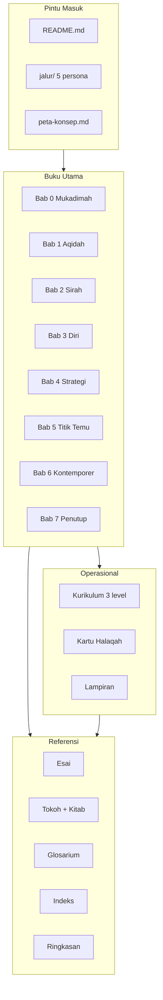

# Daftar Isi Lengkap

> Indeks terstruktur seluruh materi di repo **Generasi Pembaharu**.
>
> Untuk pilih jalur baca berdasarkan profil, buka [Jalur Persona](./jalur/) atau langsung [README](./README.md).
> Untuk cari kutipan, tokoh, atau tema, buka [`indeks/`](./indeks/).

**Legenda level**: `tamhidi` = dasar · `muayyid` = menengah · `muntasib` = lanjut · `lintas` = cocok untuk semua level
**Legenda persona**: 🌱 aktivis-baru · 🕯️ murabbi · 🧭 ketua-ldk · 📖 pembaca-mandiri · 🔬 peneliti

---

## Peta Cepat

---

## Mukadimah

| Order | ID | Judul | Level | Persona | Baca |
|---|---|---|---|---|---|
| 0 | `ch0-mukadimah-readme` | [Pengantar Mukadimah](./00-mukadimah/README.md) | lintas | 🌱📖🕯️🧭 | ~2 mnt |
| 1 | `ch0-manifesto-generasi-pembaharu` | [Manifesto Generasi Pembaharu](./00-mukadimah/01-manifesto-generasi-pembaharu.md) | tamhidi | 🌱📖🕯️🧭 | ~5 mnt |
| 2 | `ch0-peta-krisis-pemuda-islam-indonesia` | [Peta Krisis Pemuda Islam Indonesia](./00-mukadimah/02-peta-krisis-pemuda-islam-indonesia.md) | tamhidi | 🌱📖🕯️🧭 | ~6 mnt |
| 3 | `ch0-visi-kebangkitan` | [Visi Kebangkitan](./00-mukadimah/03-visi-kebangkitan.md) | tamhidi | 🌱📖🕯️🧭 | ~5 mnt |

## Bab 1: Fondasi Aqidah

| Order | ID | Judul | Level | Persona | Baca |
|---|---|---|---|---|---|
| 0 | `ch1-readme` | [Pengantar Fondasi Aqidah](./01-fondasi-aqidah/README.md) | tamhidi | 🌱📖🕯️ | ~1 mnt |
| 1 | `ch1-tauhid-sebagai-pembebasan` | [Tauhid sebagai Pembebasan](./01-fondasi-aqidah/01-tauhid-sebagai-pembebasan.md) | tamhidi | 🌱📖🕯️ | ~10 mnt |
| 2 | `ch1-aqidah-yang-menggerakkan` | [Aqidah yang Menggerakkan](./01-fondasi-aqidah/02-aqidah-yang-menggerakkan.md) | tamhidi | 🌱📖🕯️ | ~11 mnt |
| 3 | `ch1-tauhid-sosial-dan-keadilan` | [Tauhid Sosial dan Keadilan](./01-fondasi-aqidah/03-tauhid-sosial-dan-keadilan.md) | muayyid | 🌱📖🕯️ | ~10 mnt |
| 4 | `ch1-falsafah-tauhid-pergerakan` | [Falsafah Tauhid Pergerakan](./01-fondasi-aqidah/04-falsafah-tauhid-pergerakan.md) | muntasib | 🕯️🧭🔬 | ~11 mnt |

## Bab 2: Sirah & Sejarah Pergerakan

| Order | ID | Judul | Level | Persona | Baca |
|---|---|---|---|---|---|
| 0 | `ch2-readme` | [Pengantar Sirah & Sejarah](./02-sirah-dan-sejarah/README.md) | lintas | 🌱📖🕯️🔬 | ~1 mnt |
| 1 | `ch2-blueprint-nabawi` | [Blueprint Nabawi](./02-sirah-dan-sejarah/01-blueprint-nabawi.md) | muayyid | 🌱📖🕯️🔬 | ~12 mnt |
| 2 | `ch2-generasi-sahabat` | [Generasi Sahabat](./02-sirah-dan-sejarah/02-generasi-sahabat.md) | muayyid | 🌱📖🕯️🔬 | ~11 mnt |
| 3 | `ch2-para-pembaharu-klasik` | [Para Pembaharu Klasik](./02-sirah-dan-sejarah/03-para-pembaharu-klasik.md) | muayyid | 🌱📖🕯️🔬 | ~10 mnt |
| 4 | `ch2-pembaharu-modern` | [Pembaharu Modern](./02-sirah-dan-sejarah/04-pembaharu-modern.md) | muayyid | 🌱📖🕯️🔬 | ~10 mnt |
| 5 | `ch2-sejarah-pergerakan-islam-indonesia` | [Sejarah Pergerakan Islam Indonesia](./02-sirah-dan-sejarah/05-sejarah-pergerakan-islam-indonesia.md) | muayyid | 🌱📖🕯️🔬 | ~10 mnt |

## Bab 3: Pembangunan Diri

| Order | ID | Judul | Level | Persona | Baca |
|---|---|---|---|---|---|
| 0 | `ch3-readme` | [Pengantar Pembangunan Diri](./03-pembangunan-diri/README.md) | tamhidi | 🌱📖🕯️ | ~1 mnt |
| 1 | `ch3-muraqabah-dan-muhasabah` | [Muraqabah dan Muhasabah](./03-pembangunan-diri/01-muraqabah-dan-muhasabah.md) | tamhidi | 🌱📖🕯️ | ~8 mnt |
| 2 | `ch3-manajemen-ruhani-dai` | [Manajemen Ruhani Da'i](./03-pembangunan-diri/02-manajemen-ruhani-dai.md) | tamhidi | 🌱📖🕯️ | ~9 mnt |
| 3 | `ch3-intelektualitas-dan-wawasan` | [Intelektualitas dan Wawasan](./03-pembangunan-diri/03-intelektualitas-dan-wawasan.md) | muayyid | 🌱📖🕯️ | ~8 mnt |
| 4 | `ch3-kepemimpinan-profetik` | [Kepemimpinan Profetik](./03-pembangunan-diri/04-kepemimpinan-profetik.md) | muayyid | 🕯️🧭 | ~8 mnt |
| 5 | `ch3-karakter-pembaharu-sejati` | [Karakter Pembaharu Sejati](./03-pembangunan-diri/05-karakter-pembaharu-sejati.md) | muntasib | 🕯️🧭 | ~9 mnt |

## Bab 4: Strategi Dakwah

| Order | ID | Judul | Level | Persona | Baca |
|---|---|---|---|---|---|
| 0 | `ch4-readme` | [Pengantar Strategi Dakwah](./04-strategi-dakwah/README.md) | muayyid | 🕯️🧭📖 | ~1 mnt |
| 1 | `ch4-prinsip-dakwah-qurani` | [Prinsip Dakwah Qurani](./04-strategi-dakwah/01-prinsip-dakwah-qurani.md) | muayyid | 🕯️🧭📖 | ~9 mnt |
| 2 | `ch4-fiqh-dakwah-kontemporer` | [Fiqh Dakwah Kontemporer](./04-strategi-dakwah/02-fiqh-dakwah-kontemporer.md) | muayyid | 🕯️🧭📖 | ~9 mnt |
| 3 | `ch4-dakwah-digital-dan-media` | [Dakwah Digital dan Media](./04-strategi-dakwah/03-dakwah-digital-dan-media.md) | muayyid | 🕯️🧭📖 | ~9 mnt |
| 4 | `ch4-dakwah-struktural-dan-kultural` | [Dakwah Struktural dan Kultural](./04-strategi-dakwah/04-dakwah-struktural-dan-kultural.md) | muntasib | 🕯️🧭 | ~9 mnt |
| 5 | `ch4-membangun-ekosistem-dakwah` | [Membangun Ekosistem Dakwah](./04-strategi-dakwah/05-membangun-ekosistem-dakwah.md) | muntasib | 🕯️🧭 | ~10 mnt |

## Bab 5: Titik Temu Gerakan

| Order | ID | Judul | Level | Persona | Baca |
|---|---|---|---|---|---|
| 0 | `ch5-readme` | [Pengantar Titik Temu](./05-titik-temu-gerakan/README.md) | muntasib | 🕯️🧭🔬 | ~1 mnt |
| 1 | `ch5-peta-gerakan-dakwah-indonesia` | [Peta Gerakan Dakwah Indonesia](./05-titik-temu-gerakan/01-peta-gerakan-dakwah-indonesia.md) | muayyid | 🕯️🧭🔬 | ~10 mnt |
| 2 | `ch5-titik-temu-lintas-manhaj` | [Titik Temu Lintas Manhaj](./05-titik-temu-gerakan/02-titik-temu-lintas-manhaj.md) | muayyid | 🕯️🧭🔬 | ~10 mnt |
| 3 | `ch5-kolaborasi-strategis` | [Kolaborasi Strategis](./05-titik-temu-gerakan/03-kolaborasi-strategis.md) | muntasib | 🕯️🧭 | ~10 mnt |
| 4 | `ch5-blueprint-persatuan-umat` | [Blueprint Persatuan Umat](./05-titik-temu-gerakan/04-blueprint-persatuan-umat.md) | muntasib | 🕯️🧭 | ~11 mnt |

## Bab 6: Tantangan Kontemporer

| Order | ID | Judul | Level | Persona | Baca |
|---|---|---|---|---|---|
| 0 | `ch6-readme` | [Pengantar Tantangan Kontemporer](./06-tantangan-kontemporer/README.md) | muntasib | 🧭📖🔬 | ~1 mnt |
| 1 | `ch6-liberalisme-dan-identitas` | [Liberalisme dan Identitas](./06-tantangan-kontemporer/01-liberalisme-dan-identitas.md) | muntasib | 🧭📖🔬 | ~10 mnt |
| 2 | `ch6-era-post-truth-dan-media-sosial` | [Era Post-Truth dan Media Sosial](./06-tantangan-kontemporer/02-era-post-truth-dan-media-sosial.md) | muntasib | 🧭📖🔬 | ~10 mnt |
| 3 | `ch6-ai-teknologi-dan-masa-depan` | [AI, Teknologi, dan Masa Depan](./06-tantangan-kontemporer/03-ai-teknologi-dan-masa-depan.md) | muntasib | 🧭📖🔬 | ~10 mnt |
| 4 | `ch6-islam-dan-kebangsaan-indonesia` | [Islam dan Kebangsaan Indonesia](./06-tantangan-kontemporer/04-islam-dan-kebangsaan-indonesia.md) | muntasib | 🧭📖🔬 | ~10 mnt |

## Bab 7: Penutup

| Order | ID | Judul | Level | Persona | Baca |
|---|---|---|---|---|---|
| 0 | `ch7-readme` | [Pengantar Penutup](./07-penutup/README.md) | lintas | 🌱📖🕯️🧭 | ~1 mnt |
| 1 | `ch7-epilog-surat-untuk-generasi-mendatang` | [Epilog: Surat untuk Generasi Mendatang](./07-penutup/01-epilog-surat-untuk-generasi-mendatang.md) | lintas | 🌱📖🕯️🧭 | ~6 mnt |
| 2 | `ch7-doa-penutup` | [Doa Penutup](./07-penutup/02-doa-penutup.md) | lintas | 🌱📖🕯️🧭 | ~3 mnt |

---

## Kurikulum Halaqah

### Level 1 — Tamhidi (Persiapan)

| Sesi | ID | Judul | Persona | Durasi |
|---|---|---|---|---|
| 1 | `kur-l1-s1-mengenal-jati-diri` | [Mengenal Jati Diri — Siapakah Aku?](./kurikulum/level-1-tamhidi/sesi-01-mengenal-jati-diri.md) | 🕯️🌱 | 120 mnt |
| 2 | `kur-l1-s2-dasar-aqidah-gerakan` | [Dasar Aqidah Gerakan](./kurikulum/level-1-tamhidi/sesi-02-dasar-aqidah-gerakan.md) | 🕯️🌱 | 120 mnt |
| 3 | `kur-l1-s3-teladan-rasulullah` | [Teladan Rasulullah](./kurikulum/level-1-tamhidi/sesi-03-teladan-rasulullah.md) | 🕯️🌱 | 120 mnt |
| 4 | `kur-l1-s4-adab-dan-akhlak-dai` | [Adab dan Akhlak Da'i](./kurikulum/level-1-tamhidi/sesi-04-adab-dan-akhlak-dai.md) | 🕯️🌱 | 120 mnt |
| 5 | `kur-l1-s5-dasar-dakwah-fardiyah` | [Dasar Dakwah Fardiyah](./kurikulum/level-1-tamhidi/sesi-05-dasar-dakwah-fardiyah.md) | 🕯️🌱 | 120 mnt |
| 6 | `kur-l1-s6-evaluasi-dan-komitmen` | [Evaluasi dan Komitmen](./kurikulum/level-1-tamhidi/sesi-06-evaluasi-dan-komitmen.md) | 🕯️🌱 | 120 mnt |

### Level 2 — Muayyid (Pendukung)

| Sesi | ID | Judul | Persona | Durasi |
|---|---|---|---|---|
| 1 | `kur-l2-s1-pendalaman-tauhid` | [Pendalaman Tauhid](./kurikulum/level-2-muayyid/sesi-01-pendalaman-tauhid.md) | 🕯️🧭 | 120 mnt |
| 2 | `kur-l2-s2-sirah-strategis` | [Sirah Strategis](./kurikulum/level-2-muayyid/sesi-02-sirah-strategis.md) | 🕯️🧭 | 120 mnt |
| 3 | `kur-l2-s3-kepemimpinan-dakwah` | [Kepemimpinan Dakwah](./kurikulum/level-2-muayyid/sesi-03-kepemimpinan-dakwah.md) | 🕯️🧭 | 120 mnt |
| 4 | `kur-l2-s4-dakwah-digital` | [Dakwah Digital](./kurikulum/level-2-muayyid/sesi-04-dakwah-digital.md) | 🕯️🧭 | 120 mnt |
| 5 | `kur-l2-s5-analisis-gerakan` | [Analisis Gerakan](./kurikulum/level-2-muayyid/sesi-05-analisis-gerakan.md) | 🕯️🧭 | 120 mnt |
| 6 | `kur-l2-s6-proyek-dakwah` | [Proyek Dakwah](./kurikulum/level-2-muayyid/sesi-06-proyek-dakwah.md) | 🕯️🧭 | 120 mnt |

### Level 3 — Muntasib (Anggota Penuh)

| Sesi | ID | Judul | Persona | Durasi |
|---|---|---|---|---|
| 1 | `kur-l3-s1-falsafah-pergerakan` | [Falsafah Pergerakan](./kurikulum/level-3-muntasib/sesi-01-falsafah-pergerakan.md) | 🕯️🧭 | 120 mnt |
| 2 | `kur-l3-s2-strategi-makro-dakwah` | [Strategi Makro Dakwah](./kurikulum/level-3-muntasib/sesi-02-strategi-makro-dakwah.md) | 🕯️🧭 | 120 mnt |
| 3 | `kur-l3-s3-membangun-institusi` | [Membangun Institusi](./kurikulum/level-3-muntasib/sesi-03-membangun-institusi.md) | 🕯️🧭 | 120 mnt |
| 4 | `kur-l3-s4-kolaborasi-lintas-gerakan` | [Kolaborasi Lintas Gerakan](./kurikulum/level-3-muntasib/sesi-04-kolaborasi-lintas-gerakan.md) | 🕯️🧭 | 120 mnt |
| 5 | `kur-l3-s5-menjawab-tantangan-zaman` | [Menjawab Tantangan Zaman](./kurikulum/level-3-muntasib/sesi-05-menjawab-tantangan-zaman.md) | 🕯️🧭 | 120 mnt |
| 6 | `kur-l3-s6-visi-dan-aksi-pembaharu` | [Visi dan Aksi Pembaharu](./kurikulum/level-3-muntasib/sesi-06-visi-dan-aksi-pembaharu.md) | 🕯️🧭 | 120 mnt |

> Kartu ringkas fasilitator per sesi: lihat [`kartu-halaqah/`](./kartu-halaqah/).

---

## Esai

| ID | Judul | Persona | Baca |
|---|---|---|---|
| `esai-mengapa-pemuda` | [Mengapa Pemuda?](./esai/mengapa-pemuda.md) | 🌱📖 | ~5 mnt |
| `esai-dakwah-bukan-partisan` | [Dakwah Bukan Partisan](./esai/dakwah-bukan-partisan.md) | 🌱📖🕯️🧭 | ~5 mnt |
| `esai-intelektual-yang-shalih` | [Intelektual yang Shalih](./esai/intelektual-yang-shalih.md) | 🌱📖🔬 | ~5 mnt |
| `esai-surat-untuk-aktivis-kampus` | [Surat untuk Aktivis Kampus](./esai/surat-untuk-aktivis-kampus.md) | 🌱📖 | ~5 mnt |
| `esai-perempuan-pembaharu` | [Perempuan Pembaharu](./esai/perempuan-pembaharu.md) | 🌱📖🕯️🧭 | ~5 mnt |
| `esai-ekonomi-umat-dan-kemandirian` | [Ekonomi Umat dan Kemandirian](./esai/ekonomi-umat-dan-kemandirian.md) | 🧭📖🔬 | ~5 mnt |
| `esai-spiritualitas-di-era-digital` | [Spiritualitas di Era Digital](./esai/spiritualitas-di-era-digital.md) | 🌱📖 | ~5 mnt |
| `esai-dari-halaqah-ke-peradaban` | [Dari Halaqah ke Peradaban](./esai/dari-halaqah-ke-peradaban.md) | 🕯️🧭📖 | ~5 mnt |
| `esai-kritik-diri-gerakan-dakwah` | [Kritik Diri Gerakan Dakwah](./esai/kritik-diri-gerakan-dakwah.md) | 🧭🔬🕯️ | ~5 mnt |

---

## Referensi, Lampiran, Indeks, Ringkasan

### Referensi

| ID | Judul | Fungsi |
|---|---|---|
| `ref-kitab-wajib` | [Kitab & Buku Wajib](./referensi/kitab-wajib.md) | Bacaan kanonik lintas manhaj |
| `ref-tokoh-inspirasi` | [Tokoh Inspirasi](./referensi/tokoh-inspirasi.md) | Pembaharu klasik → Nusantara |
| `ref-glosarium` | [Glosarium](./referensi/glosarium.md) | 100+ istilah kunci |

### Lampiran

| ID | Judul | Fungsi |
|---|---|---|
| `lamp-panduan-fasilitator` | [Panduan Fasilitator](./lampiran/panduan-fasilitator.md) | Pegangan murabbi halaqah |
| `lamp-peta-bacaan-bertahap` | [Peta Bacaan Bertahap](./lampiran/peta-bacaan-bertahap.md) | Urutan baca sesuai level |
| `lamp-template-evaluasi` | [Template Evaluasi](./lampiran/template-evaluasi.md) | Evaluasi halaqah + peserta |

### Indeks (Temu Cepat)

| ID | Isi | File |
|---|---|---|
| `indeks-ayat-quran` | Ayat → bab yang mengutip | [indeks/ayat-quran.md](./indeks/ayat-quran.md) |
| `indeks-hadis` | Hadis → bab yang mengutip | [indeks/hadis.md](./indeks/hadis.md) |
| `indeks-tokoh` | Tokoh → tempat disebut | [indeks/tokoh.md](./indeks/tokoh.md) |
| `indeks-tema` | Tema → bab terkait | [indeks/tema.md](./indeks/tema.md) |
| `indeks-istilah` | Istilah → glosarium | [indeks/istilah.md](./indeks/istilah.md) |

### Ringkasan Shareable

- [Ringkasan 1 menit](./ringkasan/1-menit/) — 150 kata, untuk WhatsApp status
- [Ringkasan 5 menit](./ringkasan/5-menit/) — 700 kata, cocok komuter
- [Ringkasan visual](./ringkasan/visual/) — satu Mermaid per bab

### Flashcards

- [`flashcards/`](./flashcards/) — Q&A per bab untuk spaced repetition (Anki-compatible format).

### Jalur Persona

- 🌱 [jalur/aktivis-baru.md](./jalur/aktivis-baru.md)
- 🕯️ [jalur/murabbi.md](./jalur/murabbi.md)
- 🧭 [jalur/ketua-ldk.md](./jalur/ketua-ldk.md)
- 📖 [jalur/pembaca-mandiri.md](./jalur/pembaca-mandiri.md)
- 🔬 [jalur/peneliti.md](./jalur/peneliti.md)

### Meta

- [`README.md`](./README.md) — landing page
- [`CARA-MENGGUNAKAN.md`](./CARA-MENGGUNAKAN.md) — panduan penggunaan 5 jalur
- [`META-SKEMA.md`](./META-SKEMA.md) — kontrak metadata frontmatter
- [`GAYA-PENULISAN.md`](./GAYA-PENULISAN.md) — panduan gaya & komponen pedagogis
- [`peta-konsep.md`](./peta-konsep.md) — graf konsep antar bab
- [`DELIVERY.md`](./DELIVERY.md) — opsi distribusi eksternal (situs, PDF, audio)
- [`DAMPAK.md`](./DAMPAK.md) — log dampak terbuka
- [`CONTRIBUTING.md`](./CONTRIBUTING.md) — alur kontribusi
- [`testimoni/`](./testimoni/) — cerita pemakaian nyata dari lapangan
