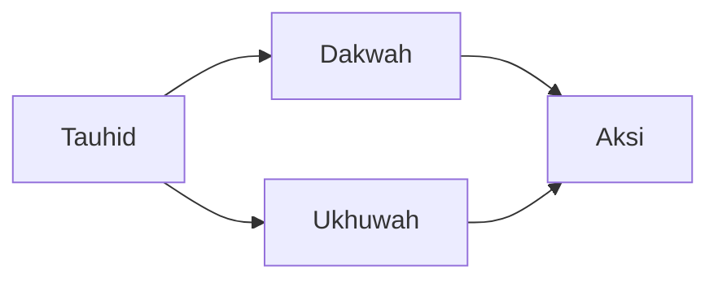

# GAYA PENULISAN — Panduan Gaya & Komponen Pedagogis

> *"Dan Kami tidak mengutus seorang rasul pun melainkan dengan bahasa kaumnya, supaya ia dapat memberi penjelasan dengan terang kepada mereka."*
> — QS. Ibrahim [14]: 4

Dokumen ini mengodifikasi gaya penulisan, struktur komponen pedagogis, dan konvensi yang berlaku di seluruh repo. Tujuannya: **menjaga konsistensi pengalaman pembaca** meski kontributor berbeda dan generasi editorial berganti.

Repo ini pure-markdown. Semua konvensi harus **render benar di github.com tanpa tooling**. Kalau sebuah konvensi butuh plugin atau generator, ia tidak boleh dipakai di sini.

---

## 1. Suara & Nada

- **Khusyu' tapi berenergi.** Seperti khutbah yang membangunkan, bukan pengajian yang menidurkan.
- **Intim, bukan akademis.** Pakai "kita" dan "kamu/Anda", hindari "penulis berpendapat".
- **Bertenaga dalil, bukan dipaksa dalil.** Quran dan Hadis hadir karena pembaca perlu melihat akarnya, bukan sekadar dekorasi.
- **Tidak menyerang manhaj.** Sintesis hikmah lintas-aliran; tidak ada serangan terhadap kelompok atau tokoh. (Lihat `CONTRIBUTING.md`.)
- **Kontekstual Indonesia 2026+.** Contoh dari LDK, Rohis, kampus, media sosial, ekonomi digital — bukan contoh generik yang melayang.

## 2. Struktur File

Setiap file konten panjang (>150 baris) mengikuti pola:

1. **Frontmatter YAML** (lihat `META-SKEMA.md`).
2. **H1** — sama persis dengan `title` di frontmatter.
3. **Epigraf** — 1 blockquote: ayat Al-Quran, hadis, atau kutipan syair/tokoh. Bentuknya:
   ```markdown
   > *"Isi kutipan dalam italic."*
   > — Sumber (QS, HR, nama tokoh)
   ```
4. **Pembuka naratif** — 2–4 paragraf yang menarik pembaca masuk sebelum istilah teknis.
5. **Bagian inti** — heading `##` per tema besar, `###` per subtema.
6. **Komponen pedagogis** — Mental Model, Rantai Logika, Titik Refleksi (lihat §3).
7. **Penutup** — 1–2 paragraf yang menutup tema, mengarahkan aksi.
8. **Titik Refleksi** — selalu di akhir, dengan heading `### Titik Refleksi`.
9. **Bacaan Terkait** — heading `### 📚 Bacaan Terkait dalam Buku Ini`.

File pendek (≤150 baris, kecuali README direktori) boleh menyederhanakan — tapi Frontmatter + Epigraf + Titik Refleksi tetap wajib bila filenya adalah konten pelajaran (bukan indeks atau meta).

## 3. Komponen Pedagogis

Tiga komponen pedagogis adalah **ciri khas** repo ini. Kalau kontribusi tidak menyertakannya, minta reviewer memeriksa kembali apakah file itu benar-benar konten pelajaran atau sekadar referensi.

### 3.1 Mental Model

Format kanonik (dari `03-pembangunan-diri/01-muraqabah-dan-muhasabah.md:49–54`):

```markdown
> **Mental Model: <Figur> — <Nama Framework>**
> 1. <Premis atau mekanisme pertama — 1 kalimat padat>
> 2. <Premis atau mekanisme kedua>
> 3. <Premis atau mekanisme ketiga>
> 4. <Premis atau mekanisme keempat>
> *Aplikasi: <Skenario dunia nyata dalam 1–2 kalimat.>*
```

Aturan:
- 3–5 butir. Kurang dari 3 terlalu tipis; lebih dari 5 jadi daftar belaka.
- Nama framework boleh berupa istilah klasik (*Harmoni Akal dan Wahyu*, *Muhasabah sebagai Gaya Hidup*) atau dirumuskan ulang.
- Baris `*Aplikasi:*` **wajib**. Tanpa aplikasi, Mental Model cuma teori indah.

### 3.2 Rantai Logika

Format kanonik (dari `kurikulum/level-1-tamhidi/sesi-01-mengenal-jati-diri.md:121–125`):

```markdown
**Rantai Logika <Tema>:**
- <Premis A> (sumber dalil / data) →
- Maka <konsekuensi 1> →
- Maka <konsekuensi 2> →
- Maka <kesimpulan atau diagnosa>
```

Aturan:
- 3–6 langkah. Setiap `→` menandai kausalitas, bukan sekadar urutan.
- Premis awal harus bersumber (ayat, hadis, data empiris, atau konsensus yang jelas).
- Kesimpulan akhir harus bisa diterjemahkan jadi aksi atau diagnosa — bukan sekadar pernyataan.

### 3.3 Titik Refleksi

Format kanonik:

```markdown
### Titik Refleksi

1. <Pertanyaan personal — tentang diri pembaca>
2. <Pertanyaan struktural — tentang konteks/organisasi pembaca>
3. <Pertanyaan visioner — tentang aksi ke depan>
4. <Pertanyaan aspirasional atau kontemplatif — sering mengacu pada ayat/hadis>
```

Aturan:
- **4–5 pertanyaan**, selalu di akhir file.
- Urutan: personal → struktural → visioner → aspirasional. Ini pola tarbiyah klasik: kenali diri → kenali sistem → bayangkan arah → naik ke transendensi.
- Pertanyaan bukan retoris. Harus bisa dijawab tertulis di jurnal.

---

## 4. GitHub Admonitions (Opsional, Terkurasi)

Sejak 2024, github.com merender blok berikut sebagai kotak berwarna:

```markdown
> [!NOTE]
> Informasi tambahan yang tidak krusial.

> [!TIP]
> Saran praktis atau aplikasi.

> [!IMPORTANT]
> Informasi yang harus diperhatikan pembaca.

> [!WARNING]
> Peringatan umum — hindari kesalahan ini.

> [!CAUTION]
> Peringatan keras — konsekuensi signifikan.
```

Pemetaan suggested:

| Admonition | Kapan dipakai |
|------------|---------------|
| `> [!NOTE]` | Catatan etimologi, asal usul istilah, latar historis singkat |
| `> [!TIP]` | Ringkasan "aplikasi langsung" yang lebih singkat dari Mental Model |
| `> [!IMPORTANT]` | Dalil krusial atau prinsip yang pembaca tidak boleh lewati |
| `> [!WARNING]` | Potensi kesalahpahaman, bid'ah pemikiran, bias kontemporer |
| `> [!CAUTION]` | Tindakan operasional yang bisa berbahaya (mis. rekrutmen tanpa tarbiyah, dakwah digital tanpa manhaj) |

**Jangan carpet-bomb.** Satu admonition per ~150 baris cukup; lebih dari itu membuat halaman terasa berisik.

## 5. Collapsible Sections

Gunakan `<details>` untuk menyembunyikan isi panjang yang bersifat opsional:

```markdown
<details>
<summary>Dalil panjang: seluruh matan hadis Muadz bin Jabal</summary>

<isi hadis panjang lengkap dengan sanad>

</details>
```

Cocok untuk: matan hadis panjang, rangkaian atsar, glosa tambahan, tabel panjang. Jangan pakai untuk sembunyikan materi inti.

## 6. Mermaid Diagrams

GitHub merender fenced block `mermaid` sebagai diagram:

````markdown

````

Gunakan untuk:
- **Peta konsep** di `peta-konsep.md` dan `<bab>/README.md`
- **Timeline** (sirah Nabawi, pergerakan Indonesia)
- **Genealogi** (tokoh, organisasi dakwah Indonesia)
- **Alur persona** (entry point ke jalur baca)
- **Rantai logika** panjang (>5 langkah) — pakai `flowchart TD`

Batasi ≤1 diagram per file kecuali di `peta-konsep.md`.

## 7. Cross-Reference

### Dalam prosa

```markdown
### 📚 Bacaan Terkait dalam Buku Ini

- [Tauhid Sosial dan Keadilan](./03-tauhid-sosial-dan-keadilan.md) — Dimensi sosial tauhid yang membebaskan
- [Kepemimpinan Profetik](../03-pembangunan-diri/04-kepemimpinan-profetik.md) — Model kepemimpinan berbasis tauhid
```

Format: `- [Judul](./path.md) — Deskriptor semantik singkat`.

### Kanonik

Lihat `META-SKEMA.md` — `related:` di frontmatter adalah **sumber kebenaran**. Kalau link prosa rusak tapi `related:` masih benar, pembaca masih bisa menemukan file lewat `id`.

## 8. Kutipan Al-Quran & Hadis

Format standar:

- **Ayat**: `QS. <Nama Surah> [<nomor surah>]: <ayat>` — contoh: `QS. Al-Baqarah [2]: 255`.
- **Hadis**: `HR. <Periwayat> no. <nomor>` + derajat — contoh: `HR. Bukhari no. 1; HR. Muslim no. 16 — muttafaq 'alaih`.
- **Atsar**: `Atsar <Nama Sahabat/Tabiin>, diriwayatkan <Periwayat>`.

Selalu cetak kutipan dalam blockquote italic:

```markdown
> *"Sesungguhnya amal itu tergantung niatnya..."*
> — HR. Bukhari no. 1, HR. Muslim no. 1907 (muttafaq 'alaih)
```

Untuk terjemahan, gunakan terjemahan Kemenag kecuali ada konteks tertentu. Sebutkan kalau bukan Kemenag.

## 9. Tulisan Arab

Tulisan Arab (اَلْحَمْدُ لِلَّٰهِ) **opsional**, bukan wajib. Kalau ditambahkan:
- Letakkan setelah transliterasi/terjemahan, bukan menggantikannya.
- Pastikan ada harakat untuk istilah pendek (nama Allah, asmaul husna, istilah kunci).
- Jangan gunakan ligatur khusus yang tidak dijamin render di semua font GitHub.

## 10. Nomor & Angka

- **Nomor ayat & hadis**: pakai angka Arab Barat (`1, 2, 3`), bukan angka Arab Timur (`١, ٢, ٣`).
- **Tahun Hijriyah**: tuliskan `H` — contoh: `622 M / 1 H`.
- **Tahun Masehi**: default, tanpa `M` kecuali ada potensi kekaburan dengan tahun H.

## 11. Istilah Tarbiyah

Repo ini memakai kosakata tarbiyah (halaqah, murabbi, liqo', tanzhim, manhaj). Gunakan **miring** (`*halaqah*`) pada kemunculan **pertama di dalam satu file**, lalu polos di kemunculan berikutnya. Semua istilah harus terdaftar di `referensi/glosarium.md`.

## 12. Nama Tokoh

- **Sahabat & Salaf**: sertakan `ra` (radhiyallahu 'anhu/ha) pada kemunculan pertama. Contoh: *Umar bin Al-Khattab ra*.
- **Nabi**: `saw` (shallallahu 'alaihi wasallam) setelah nama Nabi ﷺ, kecuali dalam judul.
- **Tokoh modern**: tulis nama penuh pada kemunculan pertama, lalu nama populer.
- **Hindari hiperbola**: "beliau yang mulia", "sang pahlawan", dst. — biarkan nama dan perbuatan berbicara.

## 13. Huruf Kapital pada Judul

Indonesian title case: kapital pada kata pertama dan semua kata kecuali kata tugas (di, ke, dari, yang, dan, atau, untuk, dengan, pada, bagi, sebagai, oleh). Contoh: **Tauhid sebagai Pembebasan**, **Dari Halaqah ke Peradaban**.

## 14. Panjang File

- **Ideal**: 150–350 baris untuk file bab atau sesi.
- **Maksimum**: 400 baris. Di atas itu, pecah jadi beberapa file dengan file induk sebagai index (lihat pola pecahan di `referensi/tokoh-inspirasi.md`, `02-sirah-dan-sejarah/01-blueprint-nabawi.md`).
- **Minimum**: tidak ada — selama komponen wajib (§2–3) terpenuhi.

## 15. Checklist Reviewer

Reviewer PR memeriksa:

- [ ] Frontmatter valid sesuai `META-SKEMA.md` (id unik, field wajib terisi)
- [ ] H1 = `title` di frontmatter
- [ ] Ada epigraf pembuka
- [ ] Mental Model, Rantai Logika, atau komponen pedagogis ada (untuk file konten)
- [ ] `### Titik Refleksi` di akhir (untuk file konten pelajaran)
- [ ] `### 📚 Bacaan Terkait dalam Buku Ini` kalau relevan
- [ ] Tidak ada serangan terhadap manhaj lain
- [ ] Dalil dikutip dengan sumber valid dan format standar
- [ ] Tidak lebih dari 400 baris, atau terpecah dengan index
- [ ] Link internal tidak rusak (click test pada semua link)
- [ ] `related:` frontmatter konsisten dengan "Bacaan Terkait" di prosa
- [ ] Tidak ada tooling baru (no `package.json`, no scripts, no workflows)

---

> *"Barangsiapa menunjukkan kepada kebaikan maka ia mendapatkan pahala seperti pelakunya."*
> — HR. Muslim no. 1893

Gaya yang konsisten adalah bentuk adab kita terhadap pembaca — ia tidak harus bingung memetakan struktur setiap kali membuka file baru.
