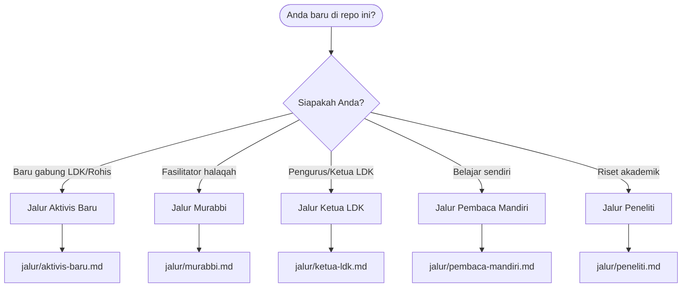
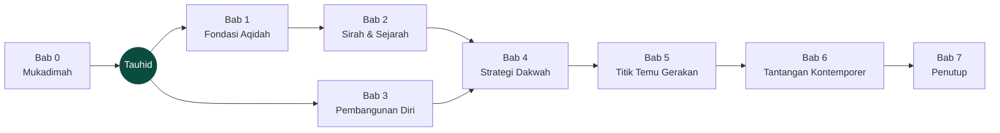

  <h1 align="center">GENERASI PEMBAHARU</h1>
  
<strong>Fondasi, Strategi, dan Peta Jalan bagi Pemuda Muslim Indonesia yang Rindu Memperbaharui Umat</strong>

  <a href="./jalur/aktivis-baru.md">Aktivis Baru</a> ·
  <a href="./jalur/murabbi.md">Murabbi</a> ·
  <a href="./jalur/ketua-ldk.md">Ketua LDK</a> ·
  <a href="./jalur/pembaca-mandiri.md">Pembaca Mandiri</a> ·
  <a href="./jalur/peneliti.md">Peneliti</a>

---

> *"Sesungguhnya Allah mengutus untuk umat ini pada setiap awal seratus tahun, orang yang memperbarui agamanya."*
> — HR. Abu Dawud no. 4291

## Thesis Satu Paragraf

Pemuda Muslim Indonesia hari ini berdiri di tiga persimpangan sekaligus: **krisis identitas** (tarik-menarik antara modernitas dan akar keislaman), **fragmentasi gerakan** (dakwah terpecah dalam sekat-sekat organisasi yang saling curiga), dan **disrupsi digital** (zaman berubah cepat, dakwah tertinggal). Repo ini adalah jawaban integral atas ketiganya — **bukan dengan semangat saja, tapi dengan fondasi aqidah yang kokoh, strategi yang tajam, hati yang hidup, dan kolaborasi lintas manhaj.** Berakar pada Al-Quran dan Sunnah; membumi di realitas Indonesia 2026; terbuka untuk seluruh manhaj dan organisasi yang tulus melayani umat.

## Mulai dari Persona Anda

| Jalur | Anda kalau... | Mulai dari | Estimasi |
|-------|---------------|------------|----------|
| 🌱 **[Aktivis Baru](./jalur/aktivis-baru.md)** | Baru bergabung LDK/Rohis, butuh fondasi | Mukadimah → Kurikulum Tamhidi | 4 minggu |
| 🕯️ **[Murabbi / Fasilitator](./jalur/murabbi.md)** | Menjalankan halaqah tarbiyah | Panduan Fasilitator → Kurikulum | Langsung pakai |
| 🧭 **[Ketua LDK](./jalur/ketua-ldk.md)** | Merancang program dakwah kampus | Strategi Dakwah → Titik Temu | 2 minggu |
| 📖 **[Pembaca Mandiri](./jalur/pembaca-mandiri.md)** | Belajar sendiri, tanpa organisasi | Mukadimah → urut per bab | Fleksibel |
| 🔬 **[Peneliti](./jalur/peneliti.md)** | Riset gerakan dakwah | Daftar Isi → Glosarium → Tokoh | Navigasi tematis |

> [!TIP]
> Belum yakin persona mana? Mulai dari **[Jalur Pembaca Mandiri](./jalur/pembaca-mandiri.md)** — paling netral dan bisa diubah kapan saja.

## Peta Buku

Delapan bab yang semuanya berpusar pada tauhid sebagai poros — dari fondasi, sejarah, pembangunan diri, strategi, kolaborasi, hingga jawaban atas tantangan zaman.

### Buku Utama

| # | Bab | Tema Kunci | Target Durasi |
|---|-----|-----------|---------------|
| 0 | [Mukadimah](./00-mukadimah/) | Manifesto, peta krisis, visi kebangkitan | ~30 menit |
| 1 | [Fondasi Aqidah](./01-fondasi-aqidah/) | Tauhid sebagai pembebasan & penggerak | ~60 menit |
| 2 | [Sirah & Sejarah](./02-sirah-dan-sejarah/) | Blueprint Nabawi → pergerakan Indonesia | ~90 menit |
| 3 | [Pembangunan Diri](./03-pembangunan-diri/) | Dari muraqabah hingga kepemimpinan | ~70 menit |
| 4 | [Strategi Dakwah](./04-strategi-dakwah/) | Prinsip Qurani → era digital & ekosistem | ~75 menit |
| 5 | [Titik Temu Gerakan](./05-titik-temu-gerakan/) | Peta gerakan → blueprint persatuan | ~70 menit |
| 6 | [Tantangan Kontemporer](./06-tantangan-kontemporer/) | Post-truth, AI, gender, kebangsaan | ~65 menit |
| 7 | [Penutup](./07-penutup/) | Surat untuk generasi mendatang, doa | ~15 menit |

Total buku utama: ~8 jam baca lambat + refleksi.

### Kurikulum Halaqah (18 Sesi)

| Level | Nama | Target Peserta | Jumlah Sesi |
|-------|------|----------------|-------------|
| 1 | [Tamhidi (Persiapan)](./kurikulum/level-1-tamhidi/) | Aktivis baru | 6 × 120 menit |
| 2 | [Muayyid (Pendukung)](./kurikulum/level-2-muayyid/) | Pengurus aktif | 6 × 120 menit |
| 3 | [Muntasib (Anggota Penuh)](./kurikulum/level-3-muntasib/) | Pemimpin dakwah | 6 × 120 menit |

Kartu ringkas fasilitator: lihat [`kartu-halaqah/`](./kartu-halaqah/).

### Esai & Referensi

- **9 Esai tematik** — lihat [`esai/`](./esai/)
- **Referensi**: [Kitab & Buku Wajib](./referensi/kitab-wajib.md) · [Tokoh Inspirasi](./referensi/tokoh-inspirasi.md) · [Glosarium](./referensi/glosarium.md)
- **Lampiran**: [Panduan Fasilitator](./lampiran/panduan-fasilitator.md) · [Peta Bacaan Bertahap](./lampiran/peta-bacaan-bertahap.md) · [Template Evaluasi](./lampiran/template-evaluasi.md)

## Indeks & Temu Cepat

Untuk pembaca yang mencari kutipan, istilah, atau tema tertentu — bukan membaca berurutan:

| Indeks | Isi | File |
|--------|-----|------|
| 📖 Ayat Al-Quran | 370+ ayat yang dikutip di seluruh repo | [indeks/ayat-quran.md](./indeks/ayat-quran.md) |
| 📜 Hadis | 470+ hadis dengan derajat dan sumber | [indeks/hadis.md](./indeks/hadis.md) |
| 👥 Tokoh | Dari sahabat hingga tokoh kontemporer | [indeks/tokoh.md](./indeks/tokoh.md) |
| 🎯 Tema | Pemetaan tema → file | [indeks/tema.md](./indeks/tema.md) |
| 📚 Istilah | Indeks alfabet ke glosarium | [indeks/istilah.md](./indeks/istilah.md) |

## Ringkasan Shareable

Untuk dibagikan di WhatsApp, Telegram, atau forum kampus:

- **[Ringkasan 1 menit per bab](./ringkasan/1-menit/)** — 150 kata, satu layar HP
- **[Ringkasan 5 menit per bab](./ringkasan/5-menit/)** — 700 kata, siap-baca komuter
- **[Ringkasan visual (diagram)](./ringkasan/visual/)** — satu Mermaid per bab

## Prinsip Repo

| Prinsip | Penjelasan |
|---------|-----------|
| **Lintas Manhaj** | Mengambil hikmah dari semua aliran, tanpa menyerang satu pun. Fokus pada titik temu. |
| **Progressive** | Materi bertingkat dari dasar (*tamhidi*) hingga lanjutan (*muntasib*). |
| **Inklusif** | Tidak partisan. Bukan milik satu organisasi. Milik umat. |
| **Actionable** | Setiap materi berakhir dengan Titik Refleksi dan aksi nyata. |
| **Kontekstual** | Berakar pada Al-Quran & Sunnah, membumi di realitas Indonesia 2026+. |
| **Pure Markdown** | Nol-tooling. Bisa di-fork, di-remix, diterjemahkan, dibaca offline. |

## Bagaimana Repo Ini Dibangun

- **Pure markdown**, tanpa build tools. Semua merender native di github.com.
- **Metadata terstruktur** — lihat [`META-SKEMA.md`](./META-SKEMA.md).
- **Gaya penulisan konsisten** — lihat [`GAYA-PENULISAN.md`](./GAYA-PENULISAN.md).
- **Graf konsep** — lihat [`peta-konsep.md`](./peta-konsep.md).
- **Cara pakai lengkap** — lihat [`CARA-MENGGUNAKAN.md`](./CARA-MENGGUNAKAN.md).
- **Daftar isi penuh** — lihat [`DAFTAR_ISI.md`](./DAFTAR_ISI.md).

## Delivery & Distribusi

Repo ini sengaja pure-markdown. Untuk menerbitkan ulang sebagai situs, PDF, atau ebook (semuanya opsional dan dikelola komunitas masing-masing), lihat **[`DELIVERY.md`](./DELIVERY.md)**.

Repo tidak memiliki analytics. Kontribusi testimoni pemakaian nyata (LDK mana yang memakai, hasil apa yang dilihat) ditampung di **[`testimoni/`](./testimoni/)** dan agregatnya di **[`DAMPAK.md`](./DAMPAK.md)**.

## Berkontribusi

Repo ini bersifat **kurasi komunitas** — kontribusi terbuka namun melalui editorial review. Panduan:

- [`CONTRIBUTING.md`](./CONTRIBUTING.md) — alur kontribusi
- [`META-SKEMA.md`](./META-SKEMA.md) — kontrak metadata
- [`GAYA-PENULISAN.md`](./GAYA-PENULISAN.md) — gaya & komponen pedagogis

## Lisensi

[Creative Commons Attribution-NonCommercial-ShareAlike 4.0 International (CC BY-NC-SA 4.0)](https://creativecommons.org/licenses/by-nc-sa/4.0/).

Anda bebas menyebarkan, mengadaptasi, menerjemahkan, dan menggunakan untuk kepentingan dakwah non-komersial, dengan tetap mencantumkan atribusi dan lisensi yang sama.

---

  <em>"Jadilah pembaharu, atau jadilah yang diperbarui oleh zaman."</em>

