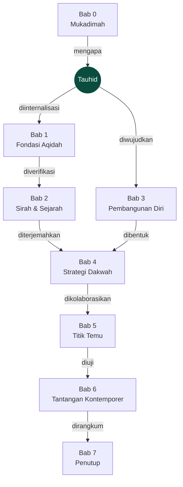
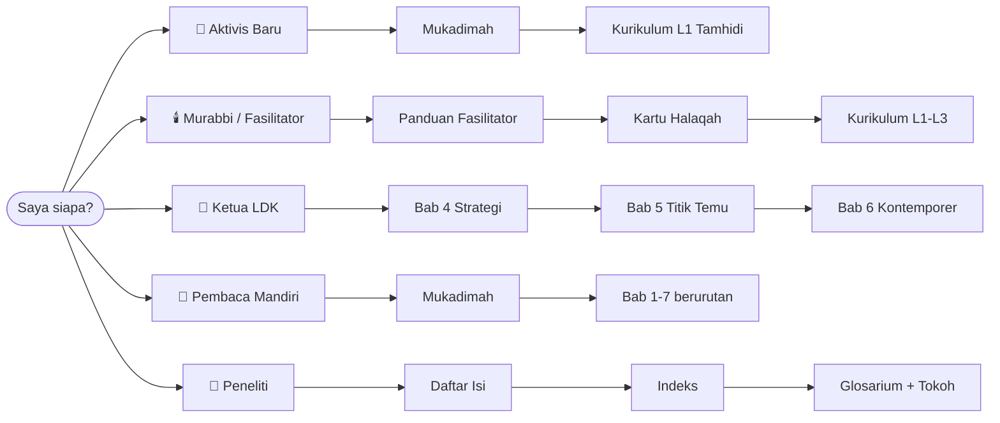
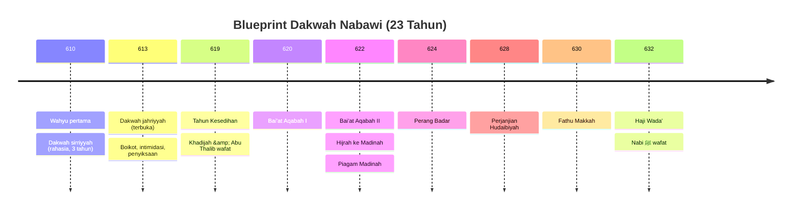
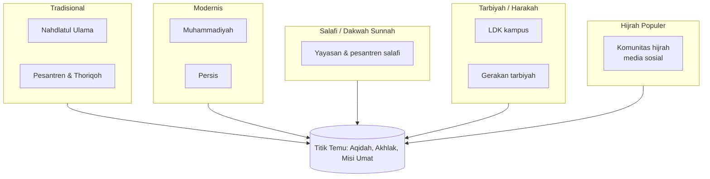
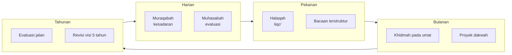
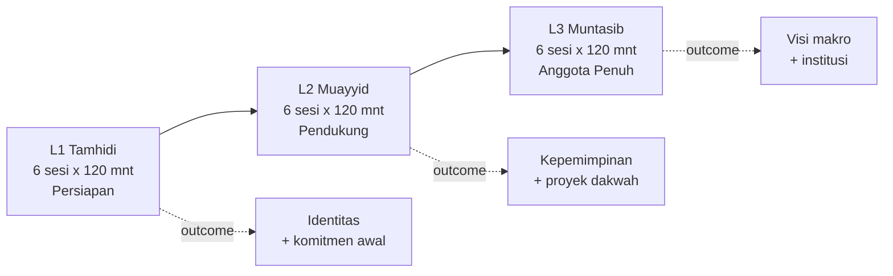
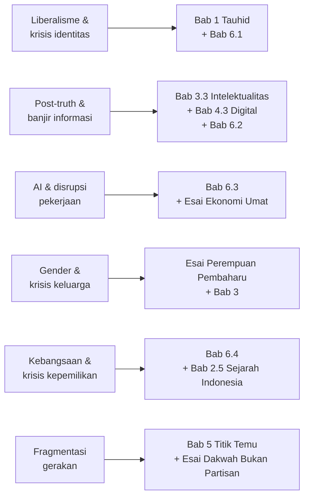
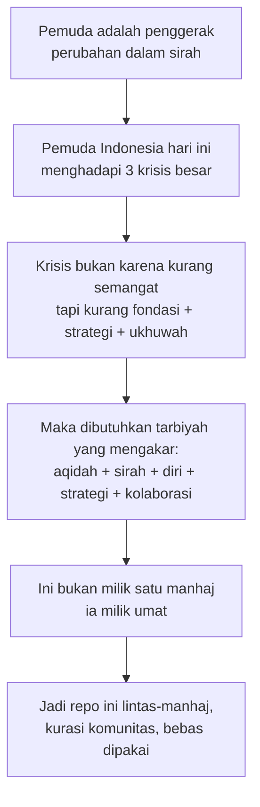
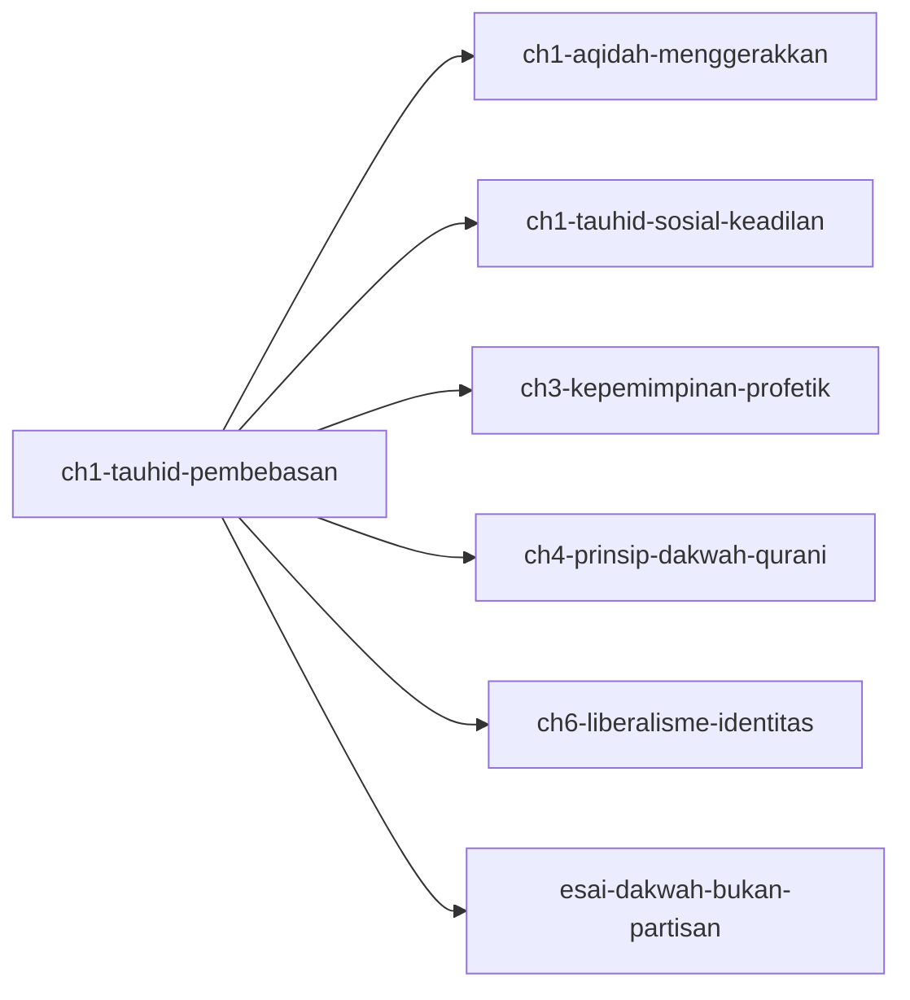

# Peta Konsep Generasi Pembaharu

> *"Dan Kami jadikan di antara mereka itu pemimpin-pemimpin yang memberi petunjuk dengan perintah Kami ketika mereka sabar. Dan mereka meyakini ayat-ayat Kami."*
> — QS. As-Sajdah [32]: 24

File ini memetakan **hubungan antar konsep** di repo ini secara visual. Tujuannya bukan menggantikan bacaan isi, tapi memberi peta agar pembaca tahu ia sedang berada di mana dan hendak ke mana.

Semua diagram di sini memakai Mermaid — dirender langsung oleh github.com tanpa build tool.

---

## 1. Peta Buku Utama: Tauhid sebagai Poros

Semua bab berpusar pada tauhid. Tidak ada bab yang berdiri sendiri.

- **B0 → T**: Mukadimah menjelaskan mengapa tauhid harus dihidupkan kembali.
- **T → B1**: Aqidah adalah pembebasan dari tirani selain Allah.
- **T → B3**: Pembangunan diri = mengikat diri pada tauhid setiap hari.
- **B1 → B2**: Sirah memverifikasi bahwa tauhid pernah melahirkan peradaban.
- **B2 → B4**: Metode Nabawi jadi sumber strategi dakwah.
- **B3 ⊕ B4 → B5**: Diri yang matang + strategi yang tajam → kolaborasi yang sehat.
- **B5 → B6**: Kolaborasi teruji oleh tantangan zaman.
- **B6 → B7**: Penutup menyerahkan estafet ke generasi berikutnya.

---

## 2. Peta Persona: 5 Jalur Baca

Detail setiap jalur: [`jalur/`](./jalur/).

---

## 3. Sirah Nabawi: Fase dan Prinsip

Baca: [`02-sirah-dan-sejarah/01-blueprint-nabawi.md`](./02-sirah-dan-sejarah/01-blueprint-nabawi.md).

---

## 4. Lanskap Gerakan Islam Indonesia

Detail: [`05-titik-temu-gerakan/01-peta-gerakan-dakwah-indonesia.md`](./05-titik-temu-gerakan/01-peta-gerakan-dakwah-indonesia.md).

---

## 5. Alur Tarbiyah Dzatiyah (Pembangunan Diri)

Baca: [`03-pembangunan-diri/`](./03-pembangunan-diri/).

---

## 6. Progresi Kurikulum Halaqah

Baca: [`kurikulum/`](./kurikulum/). Kartu ringkas: [`kartu-halaqah/`](./kartu-halaqah/).

---

## 7. Peta Tantangan Kontemporer → Jawaban Repo

---

## 8. Rantai Logika Utama Repo

---

## 9. Graf Cross-Reference (Contoh)

Setiap bab mereferensikan bab lain. Berikut contoh rajutan Bab 1 → seluruh buku.

Graf kanonik hidup di field `related:` di frontmatter setiap file (lihat [`META-SKEMA.md`](./META-SKEMA.md)).

---

## 10. Navigasi Cepat dari Halaman Ini

- Cari **tema** → [`indeks/tema.md`](./indeks/tema.md)
- Cari **ayat atau hadis** → [`indeks/ayat-quran.md`](./indeks/ayat-quran.md) · [`indeks/hadis.md`](./indeks/hadis.md)
- Cari **tokoh** → [`indeks/tokoh.md`](./indeks/tokoh.md)
- Cari **istilah** → [`referensi/glosarium.md`](./referensi/glosarium.md) via [`indeks/istilah.md`](./indeks/istilah.md)
- Cari **sesi halaqah** → [`kurikulum/`](./kurikulum/) + [`kartu-halaqah/`](./kartu-halaqah/)
- Mau **share di grup** → [`ringkasan/1-menit/`](./ringkasan/1-menit/)

---

> *"Dan Tuhanmu tidak melupakan."* — QS. Maryam [19]: 64

Peta ini insya Allah hidup. Kalau ada konsep yang belum terwakili, buka PR.
