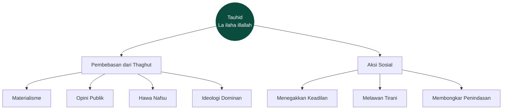
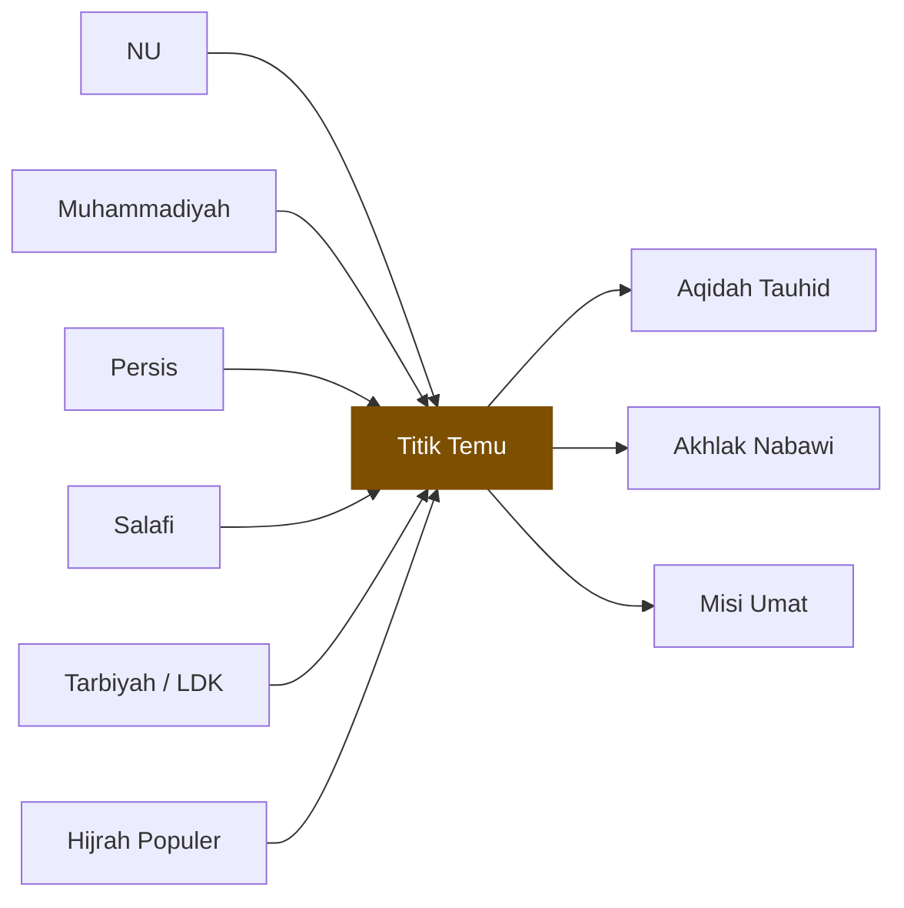

# Ringkasan Visual per Bab

Satu Mermaid diagram per bab. Dirender langsung oleh github.com. Screenshot untuk status WhatsApp / IG story / slide pendek.

## Contoh: Bab 1 — Tauhid sebagai Pembebasan



Ambil screenshot, post dengan caption: *"Tauhid bukan dogma — ia pembebasan. Baca [link bab]."*

## Contoh: Bab 5 — Titik Temu



---

## Status per Bab

| Bab | Status |
|-----|--------|
| 0 | menunggu draf |
| 1 | contoh di atas |
| 2 | menunggu draf |
| 3 | menunggu draf |
| 4 | menunggu draf |
| 5 | contoh di atas |
| 6 | menunggu draf |
| 7 | menunggu draf |

## Cara Kontribusi

1. Baca bab asli. Identifikasi 1 konsep inti yang bisa divisualisasikan.
2. Gambar di Mermaid Live Editor (mermaid.live) — gratis, no login.
3. Simpan sebagai `ch<N>.md` dengan blok ```` ```mermaid ```` di dalam.
4. Buka PR.

**Tips**:
- Pakai `flowchart` untuk konsep statis, `timeline` untuk sirah, `pie` untuk distribusi.
- Maksimum 8-10 node per diagram — lebih dari itu sulit screenshot.
- Label dalam Indonesia.
- Pakai `classDef` untuk highlight node utama dengan warna.

## 📚 Bacaan Terkait

- [`peta-konsep.md`](../../peta-konsep.md) — diagram lintas-bab.
- [`GAYA-PENULISAN.md §6`](../../GAYA-PENULISAN.md) — aturan Mermaid di repo.
